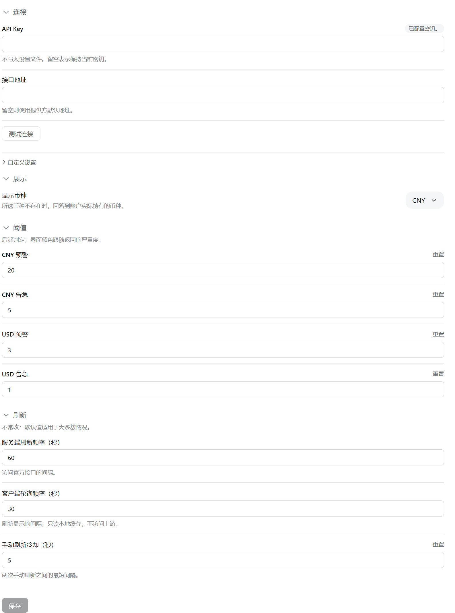

# ds-balance

[English](README_en.md)

[](.github/workflows/ci.yml)
[](LICENSE)
[](package.json)
[](package.json)

> **NOTE**
> 本包尚未发布（`private: true`），只能从源码安装。发布流程与版本号判定链见
> [docs/PUBLISHING.md](docs/PUBLISHING.md)。

在 DSH 的左边栏底部显示 DeepSeek 账户余额，并在设置里提供一张配置卡片。
余额真实读自官方 `GET /user/balance`；颜色只由后端返回的 `severity` 决定。



## 能力

- 侧栏底部常驻一个状态圆环加名称，点击展开浮层看余额明细；折叠与展开共用同一个圆环。
- 真实读取 DeepSeek 官方余额（`GET /user/balance`），按 `serverRefreshSeconds` 在服务端刷新，
  浏览器按 `clientPollSeconds` 取缓存，不穿透到上游。
- 浮层：余额、赠送 / 充值拆分、数据新鲜度与手动刷新（带冷却）。
- 多币种：由**后端**选定展示币种；设置里选的币种不在账户里时，浮层说明并给出一键改用。
- 设置卡片分四组、各自可折叠：连接 / 展示 / 阈值 / 刷新，默认四组全收起；组内有非法草稿时该组强制展开。
- 凭据字段带「已配置 / 未配置 / 已覆盖」徽标；凭据默认继承官方模型页配好的那一份，不必重填。
- 只按后端给的 `severity` 上色，阈值策略不在前端。

## 安装

前置：DSH `^0.1.6-alpha.1`，Node `>=20`。

从 npm 安装尚未开放（包未发布）。从源码安装：

```bash
git clone https://github.com/zlZayn/dsh-ds-balance.git
cd dsh-ds-balance
npm install
npm run build
dsh plugin --profile <profile> add .
```

装完还要把插件行写进该 profile 的 `cordis.patch.yml`；完整步骤与回滚方式见
[AGENTS.md](AGENTS.md) 的「常用命令」。

**宿主半边改了代码必须重启 DSH**；浏览器半边由客户端热更换入。

装好之后它在两处出现：设置 → 插件 → 插件配置里的配置卡片，以及左边栏底部的状态圆环。

## 配置

卡片分四组，默认全收起：

- 连接：只读的凭据状态、可编辑的 API 地址，以及收在二级「自定义设置」里的 apiKey 与 apiKeyRef。
- 展示：金额用哪种币种，或让它自动跟随账户。
- 阈值：几档提醒线。**只存不判** —— 前端不据此上色。
- 刷新：服务端刷新周期与浏览器轮询周期。

## 数据从哪来、到哪去

- 端点由宿主半边通过 `ctx.connection.fetch` 注册在 `/api/v1/*` 下，物理载体已做完信任与浏览器鉴权。
- **API Key 永不返回前端**：配置接口只回一个固定长度的掩码串，连末几位也不给。
- 密钥只经 DSH 的凭据通道解析，不落日志、不落本插件的文件。
- 余额快照落在 DSH 自己的存储目录（`ctx.storageDomain`），按凭据派生出的账本标识分组；
  换 key 自动开新账本，旧快照不会被混用。
- 一个非记录型文件 `.salt` 落在 `$DSH_HOME` 下，用来派生账本标识；**它丢了旧快照会读不回来**。

## 界面与后端的边界

- 颜色只由后端 `severity` 决定，前端不做任何金额比较。
- 金额一律是八位小数的字符串，前端按字符串裁两位显示，不经过浮点数。
- 完整响应形状与配置契约 → [docs/ui-handoff.md](docs/ui-handoff.md)。

## 贡献

报 bug、提功能与提 PR 的前置条件见 [CONTRIBUTING.md](CONTRIBUTING.md)。

## License

MIT，见 [LICENSE](LICENSE)。
