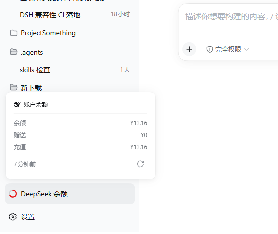

<p align="center">
  <h1 align="center">dsh-ds-balance</h1>
</p>

<div align="center">
  <p><strong>把 DeepSeek 账户余额放进 DSH 的左边栏</strong></p>
  <p><em>DeepSeek account balance in the DSH sidebar</em></p>

  <p>
    <a href="https://api-docs.deepseek.com/"></a>
    <a href="https://github.com/deepseek-ai/deepseek-harness"></a>
  </p>

  <p>
    <a href="https://github.com/zlZayn/dsh-ds-balance/actions/workflows/ci.yml"></a>
    <a href="https://www.npmjs.com/package/dsh-ds-balance"></a>
    <a href="LICENSE"></a>
  </p>

  <p>
    <strong><a href="README.md">简体中文</a></strong> · <a href="README_en.md">English</a>
  </p>
</div>

---

> [!NOTE]
> **余额读自官方 `GET /user/balance`**，不是估算，也不是别处的缓存。金额全程按八位小数字符串处理，
> 不经过浮点数；颜色**只由后端返回的 `severity` 决定**，前端不做任何金额阈值判断。

余额要有地方看，但不该占地方。左边栏底部一个常驻的状态圆环，点开是三段金额与数据新鲜度；
要看细的、要改配置的，都在设置页那一张卡片里。

<p align="center">
  
  <br>
  <em>常驻<strong>左边栏底部</strong>，与「使用统计」「设置」并排；点开是余额、赠送 / 充值拆分与数据新鲜度。</em>
</p>

## 能力一览

| 界面 | 一句话 | 你会用它来 |
|---|---|---|
| 侧栏圆环 | 常驻左边栏底部的状态环 + 名称，**弧长是余额占该币种预警线的比例** | 扫一眼就知道还剩多少、离预警线多远 |
| 余额浮层 | 点条目展开：总额、赠送 / 充值拆分、数据新鲜度、手动刷新（带冷却） | 核对具体数字，以及数据是几分钟前的 |
| 设置卡片 | 连接 / 展示 / 阈值 / 刷新四组，各自可折叠，默认四组全收起 | 换端点、换币种、调预警线、调节奏 |

三种界面的分工是死的：**圆环回答「大概还剩多少」，浮层回答「具体是多少」，卡片回答「怎么算」。**

<p align="center">
  
  <br>
  <em>在 <strong>设置 → 插件 → 插件配置</strong> 中与其他插件并排；四组默认全收起，卡片一打开只占四行折叠头。</em>
</p>

## 能力

- 侧栏底部常驻一个状态圆环加名称，点击展开浮层看余额明细；折叠与展开共用同一个圆环。
- 真实读取 DeepSeek 官方余额（`GET /user/balance`），按 `serverRefreshSeconds` 在服务端刷新，
  浏览器按 `clientPollSeconds` 取缓存，不穿透到上游。
- 浮层：余额、赠送 / 充值拆分、数据新鲜度与手动刷新（带冷却）。
- 多币种：由**后端**选定展示币种；设置里选的币种不在账户里时，浮层说明并给出一键改用。
- 设置卡片分四组、各自可折叠：连接 / 展示 / 阈值 / 刷新，默认四组全收起；组内有非法草稿时该组强制展开。
- 凭据字段带「已由启动环境提供 / 已配置 / 未配置 / 已覆盖」徽标；只读时框内留空，由徽标与说明行交代原因。
  凭据默认继承官方模型页配好的那一份，不必重填。
- 只按后端给的 `severity` 上色；阈值只用来定圆环弧长，不参与配色。

## 安装

### 前置

- **DSH `^0.1.6-alpha.1`** —— 即 [package.json](package.json) 的 `engines.dsh` 与 `peerDependencies` 声明的范围。
- Node `>= 20`

装宿主时**要显式指定版本线**：`@deepseek-ai/dsh` 的 `latest` 标签指向 `0.1.5-rc.1`，比本插件要求的还低一格 —— 按默认方式装会落在声明范围之外。

```bash
npm install -g @deepseek-ai/dsh@alpha     # 本插件承诺支持的线
```

兼容性不是推断出来的：每周由 [compat.yml](.github/workflows/compat.yml) 对 `alpha` 与 `next` 两条线换包实跑一遍现有测试。当前结论与红了怎么办见 [docs/PUBLISHING.md](docs/PUBLISHING.md) 的「兼容性」。

### 从 npm 安装

```bash
dsh plugin --profile web add dsh-ds-balance
```

包内声明了 `dsh.bundle.patch`，`dsh plugin` 会把它作为 profile 层写进 `dsh.profile.bundles`。**重启 `dsh --profile web` 后生效。**

### 从源码安装

```bash
git clone https://github.com/zlZayn/dsh-ds-balance.git
cd dsh-ds-balance
npm install && npm run build

dsh plugin --profile web add "$PWD"
```

与 npm 那条路一样靠 bundle 层装载，重启后生效。改宿主半边必须重启 —— 浏览器半边由 `dsh-client-hmr` 自动热换。

### 发现与安装

- **npm**：[`dsh-ds-balance`](https://www.npmjs.com/package/dsh-ds-balance)
- **GitHub**：[`zlZayn/dsh-ds-balance`](https://github.com/zlZayn/dsh-ds-balance)

仓库带有 GitHub topic [`dsh-plugin`](https://github.com/topics/dsh-plugin)，插件市场据此自动发现插件。

## 配置

打开 **设置 → 插件 → 插件配置 → DeepSeek 余额**，四组各自可折叠：

- **连接**：只读的凭据状态、可编辑的 API 地址，以及收在二级「自定义设置」里的 apiKey 与 apiKeyRef。
- **展示**：金额用哪种币种，或让它自动跟随账户。
- **阈值**：每个币种两档提醒线（预警 / 告急）。**只存不判** —— 前端不据此上色，颜色仍由后端的 `severity` 决定；
  唯一读它的地方是圆环弧长。
- **刷新**：服务端刷新周期与浏览器轮询周期。

### 阈值的两条硬规则

- **同一币种内，告急必须严格低于预警。** 相等也拒绝：那时余额恰好压线会被同时判成两档，「预警」就不存在了。
  宿主在写入前校验（错误信息指向具体币种），前端在失焦后提示、并置灰保存。改完保存即生效。
- **圆环弧长就是余额占预警线的比例**，100% 封顶。告急线不参与弧长 —— 它已经在后端决定了颜色。
  阈值没配或非正数时退回按 `severity` 定性：绿 / 灰满环、琥珀 3/4、红 1/4、未知空环。

### 凭据

密钥只经 DSH 的凭据通道解析，卡片里的「API 密钥」继承官方模型页配好的那一份。
由启动环境（环境变量）提供时，字段是只读的，徽标显示「已由启动环境提供」。

## 安全与边界

- 端点由宿主半边通过 `ctx.connection.fetch` 注册在 `/api/v1/*` 下，物理载体已做完信任与浏览器鉴权。
- **API Key 永不返回前端**：配置接口只回一个固定长度的掩码串，连末几位也不给。
- 密钥不落日志、不落本插件的文件。
- 余额快照落在 DSH 自己的存储目录（`ctx.storageDomain`），按凭据派生出的账本标识分组；
  换 key 自动开新账本，旧快照不会被混用。
- 一个非记录型文件 `.salt` 落在 `$DSH_HOME` 下，用来派生账本标识；**它丢了旧快照会读不回来**。
- 只访问 `api.deepseek.com`，不代理、不转发其他流量。完整响应形状见 [docs/ui-handoff.md](docs/ui-handoff.md)。

## 许可

[MIT](LICENSE)。

## 贡献

外部贡献入口（报 bug 带什么、提功能前先翻什么、提 PR 前做什么）→ [CONTRIBUTING.md](CONTRIBUTING.md)。

设计取向：**颜色只由后端 `severity` 决定，前端不做金额判断**；界面只用原生插槽与 `--dsw-*` 语义令牌。
写法规范见 [docs/ARCHITECTURE.md](docs/ARCHITECTURE.md)。

维护者文档地图见 [AGENTS.md](AGENTS.md)；发布流程与版本号判定链见 [docs/PUBLISHING.md](docs/PUBLISHING.md)。
