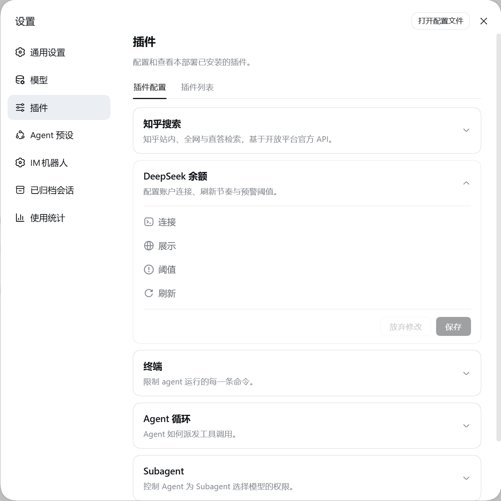

<p align="center">
  <h1 align="center">dsh-ds-balance</h1>
</p>

<div align="center">
  <p><strong>把 DeepSeek 账户余额放进 DSH 的左边栏</strong></p>
  <p><em>DeepSeek account balance in the DSH sidebar</em></p>

  <p>
    <a href="https://api-docs.deepseek.com/"></a>
    <a href="https://github.com/deepseek-ai/deepseek-harness"></a>
  </p>

  <p>
    <a href="https://github.com/zlZayn/dsh-ds-balance/actions/workflows/ci.yml"></a>
    <a href="https://www.npmjs.com/package/dsh-ds-balance"></a>
    <a href="LICENSE"></a>
  </p>

  <p>
    <strong><a href="README.md">简体中文</a></strong> · <a href="README_en.md">English</a>
  </p>
</div>

---

> [!NOTE]
> **余额读自 DeepSeek 官方 `GET /user/balance`**，不是估算。凭据只经 DSH 的凭据通道解析：API Key 不会出现在设置文件里，也不会返回给界面。

余额要有地方看，但不该占地方。左边栏底部一个常驻的状态环，点开是三段金额与数据新鲜度；要改配置，进侧边栏**插件（Plugins）**页里本插件的详情页。

<p align="center">
  
  <br>
  <em>常驻<strong>左边栏底部</strong>，与「使用统计」「设置」并排；点开是余额、赠送 / 充值拆分与数据新鲜度。</em>
</p>

## 界面一览

| 界面 | 一句话 | 你会用它来 |
|---|---|---|
| 侧栏圆环 | 常驻左边栏底部的状态环 + 名称，**展开态悬浮条目就报出余额金额**，**环里填了多少 = 余额离该币种预警线还有多远** | 扫一眼就知道还剩多少、离预警线多远 |
| 余额浮层 | 点条目展开：总额、赠送 / 充值拆分、数据新鲜度、手动刷新（带冷却）；**右上角图标一键跳到插件页** | 核对具体数字，以及数据是几分钟前的 |
| 设置卡片 | 连接 / 展示 / 阈值 / 刷新四组，**默认四组全收起**，点组头逐组展开 | 换端点、换币种、调预警线、调节奏 |

三种界面的分工是死的：**圆环回答「大概还剩多少」，浮层回答「具体是多少」，卡片回答「怎么算」。**

<p align="center">
  
  <br>
  <em>卡片就是这四组：默认四组全收起，点组头逐组展开；组里有填错的项时那一组会自己展开。</em>
</p>

## 能力

- 左边栏底部常驻一个状态环加名称，点开看明细；收起与展开是同一个环，位置不变。
- 余额按设定的周期自动刷新，界面读的是缓存 —— 开着界面不会反复去打上游接口。
- 浮层给出总额、赠送 / 充值拆分、数据是多久之前的，以及一个带冷却的手动刷新；标题那行「鲸鱼图标 + DeepSeek 余额」本身是外链，点开是新标签页里的[官网用量页](https://platform.deepseek.com/usage)。
- 多币种：显示哪个币种由账户决定；设置里选的币种账户里没有时，浮层会说明并给「改用实际币种」——**点它直接写进设置**，设置页那一格跟着变；宿主不可写时按钮置灰。
- 设置卡片分四组、**默认全收起**、点组头展开；组里有填错的项时，那一组会自己展开。
- 凭据默认继承官方模型页配好的那一份，不必重填；徽标只报「已配置密钥。/ 未配置密钥。」（官方卡片同款），
  只读时不给编辑，并说明原因。
- 颜色只表达状态（正常 / 偏低 / 告急），与金额大小无关；读法与理由见「[圆环怎么读](#圆环怎么读)」。

## 安装

### 前置

- **DSH**：版本范围以 [package.json](package.json) 的 `engines.dsh` 与 `peerDependencies` 为准，本插件跟的是宿主当前那条 alpha 线。
- Node `>= 20`（同上，真源是 `engines.node`）。

装宿主时**要显式点名版本线**：`@deepseek-ai/dsh` 的 `latest` 标签比本插件要求的那条线还旧 —— 按默认方式装会落在声明范围之外。

```bash
npm install -g @deepseek-ai/dsh@alpha     # 本插件承诺支持的线
```

兼容性不是推断出来的：每周由 [compat.yml](.github/workflows/compat.yml) 在 `alpha` 与 `next` 两条线上换包实跑一遍现有测试，另有一步单独判声明面罩不罩得住；红了会开或更新一条固定标题的跟踪 issue。当前结论与红了怎么办见 [兼容性](docs/PUBLISHING.md#兼容性)，宿主版本的分水岭见[版本兼容](#版本兼容)。

### 从 npm 安装

```bash
dsh plugin --profile web add dsh-ds-balance
```

装完**重启 `dsh --profile web`** 生效。

### 从源码安装

```bash
git clone https://github.com/zlZayn/dsh-ds-balance.git
cd dsh-ds-balance
npm install && npm run build

dsh plugin --profile web add "$PWD"
```

与 npm 那条路一样，重启后生效。

### 发现与安装

- **npm**：[`dsh-ds-balance`](https://www.npmjs.com/package/dsh-ds-balance)
- **GitHub**：[`zlZayn/dsh-ds-balance`](https://github.com/zlZayn/dsh-ds-balance)

仓库带有 GitHub topic [`dsh-plugin`](https://github.com/topics/dsh-plugin)，插件市场据此自动发现插件。

## 版本兼容

- 配置界面注册在宿主的 `plugins.row.config` 槽，key 逐字是 `<包名>#<行 id>`（本插件两者同名）。**卡片落到这一格是下游迁移的结果**：更早的宿主上它挂在 `plugins.bundle.config`，而宿主没删那个槽 —— 变的是那一格渲染时不再带 `form`。下限的真源是 [package.json](package.json) 的 `engines.dsh`，现状现查 `node scripts/compat-swap.mjs check`。
- 下限抬上去的原因**不是槽，是设置接缝换了**：客户端侧的作用域服务被删、宿主侧 `settings.register` 被删，两半改用新的 `configForms` 与 volatile 配置引用。更早的宿主上圆环与浮层照常工作，只是**配置页出不来**（不报错）—— 这就是分水岭。插件不查宿主版本号，只探测 `plugins.row.config` 那一格在不在；探测不到时**浮层里会多一行英文 `[WARN]`**，说明配置界面为什么不可用、该往哪儿升级。
- 需要配置界面，就把宿主升到 `engines.dsh` 声明的那一版或更高：`npm install -g @deepseek-ai/dsh@alpha`。
- 声明是**窄**的：下限是我们实测过的那一版，用 `>=` 而**不设上限** —— 既不承诺「以后都兼容」，也不会因为宿主多推一个预发布段就失效。为什么这么定见[兼容性](docs/PUBLISHING.md#兼容性)。

## 配置

打开侧边栏 **插件（Plugins）** →「已安装（Installed）」组 → 点进 **dsh-ds-balance** 的详情页 → 在它那一行上点 **Configure**；配置表单是**该行的独立子页**，四组**默认全收起**，点组头逐组展开：

<p align="center">
  
  <br>
  <em>Plugins 页列表里的位置：<code>dsh-ds-balance</code> 与其他已安装插件并排；点进它的详情页、再点那一行的 Configure 才是上面那张配置表单。</em>
</p>

- **连接**：API 地址与凭据，两项都默认留空 —— 地址留空即用 DeepSeek 官方端点，凭据继承官方模型页那一份、只读不可改；
  二级「自定义设置」里只放凭据引用名。
- **展示**：金额用哪种币种，或让它自动跟随账户。
- **阈值**：每个币种两档提醒线（预警 / 告急）。同一币种内**告急必须严格低于预警**，相等也会被拒绝。
  `POST /api/v1/config` 也按这条判，违反回 `422`；
  但**手改配置文件写成的非法组合不会再报错** —— 宿主那一侧已经不再强制它，插件会在读到的那一刻把这一对**回落成默认值**并在日志里记一次。

> **升级提示**：设置项存在插件那一行的配置里，键名跟着宿主升级变过一次，**旧值不会自动迁移** —— 升级后请照上表重填一次。
- **刷新**：服务端刷新周期与界面轮询周期。

保存即生效，不必重启 DSH。

### 圆环怎么读

- 环里填多少 = 当前余额占该币种**预警线**的比例，100% 封顶；告急线不参与画环 —— 它已经决定了颜色。
- 颜色只表达状态，与金额大小无关：正常、偏低、告急各一色；账户读不到时另画一个带叉号的环。
- 没配阈值的币种退回按状态定性：正常与不可用画满环，偏低 3/4，告急 1/4，未知空环。
- 为什么颜色不由金额算、阈值为什么只当刻度 → [数据流](docs/ARCHITECTURE.md#数据流)。

### 凭据

密钥只经 DSH 的凭据通道解析，卡片里的 `API Key` 一栏默认继承官方模型页配好的那一份，且只读不可改。
由启动环境（环境变量）提供时，字段只读，徽标写明来源。

## 安全与边界

- **API Key 永不返回界面**：配置接口只回一个固定长度的掩码串，连末几位也不给。
- 密钥不落日志、不落本插件的文件；设置文件里只有引用名，卡片可以安全截图或分享。
- 余额快照存在 DSH 自己的数据目录里，按凭据派生出的账本标识分组 —— 换 key 自动开新账本，旧快照不会被混用。
- 账本标识还要一个 `.salt` 文件（在 DSH 的 home 目录下）参与派生；**它丢了，旧快照就读不回来**。
- 只访问 `api.deepseek.com`，不代理、不转发其他流量。

## 许可

[MIT](LICENSE)。

## 贡献

外部贡献入口（报 bug 带什么、提功能前先翻什么、提 PR 前做什么）→ [CONTRIBUTING.md](CONTRIBUTING.md)。

设计取向与实现约束 → [docs/ARCHITECTURE.md](docs/ARCHITECTURE.md)；发布流程与版本号判定 → [docs/PUBLISHING.md](docs/PUBLISHING.md)；维护者文档地图 → [AGENTS.md](AGENTS.md)。
