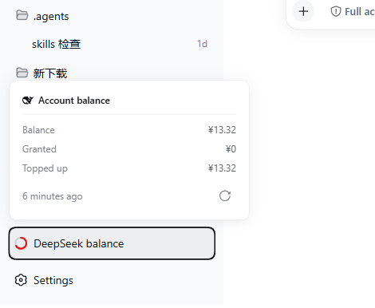
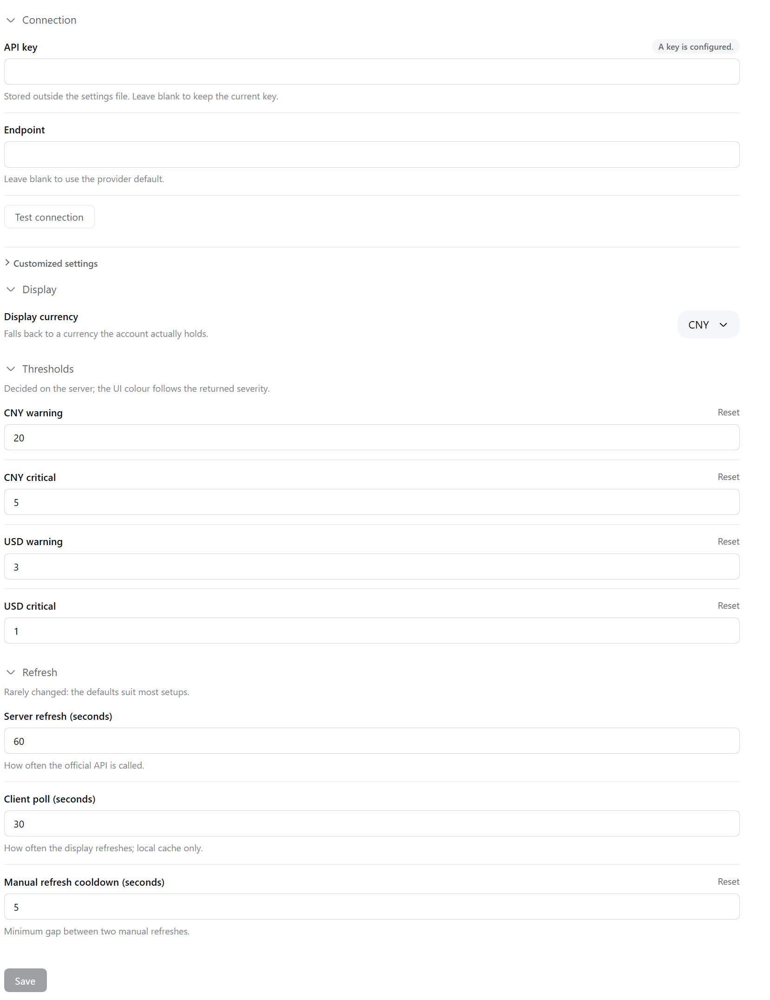
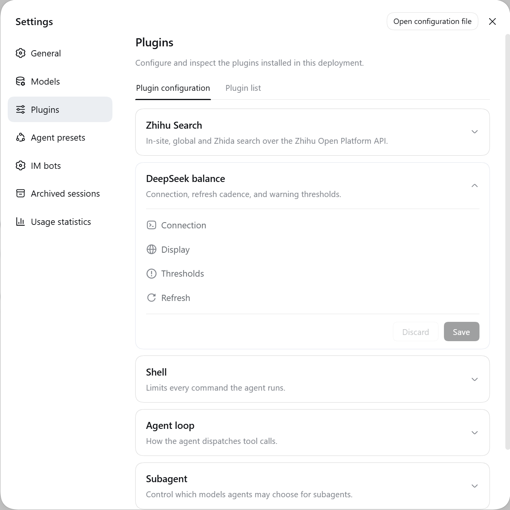

<p align="center">
  <h1 align="center">dsh-ds-balance</h1>
</p>

<div align="center">
  <p><strong>DeepSeek account balance in the DSH sidebar</strong></p>
  <p><em>把 DeepSeek 账户余额放进 DSH 的左边栏</em></p>

  <p>
    <a href="https://api-docs.deepseek.com/"></a>
    <a href="https://github.com/deepseek-ai/deepseek-harness"></a>
  </p>

  <p>
    <a href="https://github.com/zlZayn/dsh-ds-balance/actions/workflows/ci.yml"></a>
    <a href="https://www.npmjs.com/package/dsh-ds-balance"></a>
    <a href="LICENSE"></a>
  </p>

  <p>
    <a href="README.md">简体中文</a> · <strong><a href="README_en.md">English</a></strong>
  </p>
</div>

---

> [!NOTE]
> **The balance is read from the official `GET /user/balance`** — not estimated. The credential is resolved only through DSH's credential channel: the API key never lands in a settings file and is never returned to the UI.

The balance needs somewhere to live that does not take up room. A permanent status ring at the bottom of the sidebar; click it for the three amounts and the freshness of the data. Anything you want to configure lives on the plugin's details page under **Plugins → Installed**.

<p align="center">
  
  <br>
  <em>A permanent fixture at the <strong>bottom of the sidebar</strong>, alongside Usage statistics and Settings; click it for the balance, the granted / topped-up split, and how fresh the data is.</em>
</p>

## Surface at a glance

| Surface | One line | Use it for |
|---|---|---|
| Sidebar ring | A status ring plus label at the bottom of the sidebar; **in the expanded state, hovering the entry reports the balance amount**, and **how full it is = how far the balance is from that currency's warning line** | Seeing at a glance how much is left and how close it is to the warning line |
| Balance popover | Click the entry: total, granted / topped-up split, data freshness, manual refresh (with cooldown); **an icon at its top right jumps straight to the Plugins page** | Checking the exact figures, and how many minutes old they are |
| Settings card | Connection / Display / Thresholds / Refresh, **all collapsed by default**, expand a group from its header | Changing the endpoint, the currency, the warning lines, the cadence |

The division of labour is fixed: **the ring answers "roughly how much is left", the popover answers "exactly how much", and the card answers "how is that computed".**

<p align="center">
  
  <br>
  <em>The card is those four groups: all collapsed by default, expanded one header at a time; a group holding a bad value opens itself.</em>
</p>

## Capabilities

- A permanent status ring plus label at the bottom of the sidebar; click it for the breakdown. The collapsed and expanded states share the same ring, in the same place.
- The balance refreshes on its own schedule and the UI reads a cache — leaving the interface open does not hammer the upstream.
- The popover shows the total, the granted / topped-up split, how old the data is, and a manual refresh with a cooldown; its title line (whale icon + "DeepSeek balance") is itself a link that opens the [official usage page](https://platform.deepseek.com/usage) in a new tab.
- Multiple currencies: the account decides which currency is shown; when the one chosen in settings is absent, the popover explains and offers "switch to the shown currency" — **that writes straight into settings**, and the settings field follows; the button is disabled when the Host is not writable.
- The settings card has four groups, **all collapsed by default**, expanded one header at a time; a group holding a bad value opens itself.
- The credential is inherited from the official model settings by default, so there is nothing to re-enter; where it comes from is on a badge
  (a key is configured / no key is configured, exactly the official card's wording), and a read-only field explains itself instead of offering an edit.
- Colour carries state only (normal / low / critical), never an amount; see "[Reading the ring](#reading-the-ring)".

## Installation

### Requirements

- **DSH**: the range is whatever [package.json](package.json) declares under `engines.dsh` and `peerDependencies`; this plugin follows the alpha line the host is on.
- Node `>= 20` (same source of truth: `engines.node`).

Install the host by **naming the version line explicitly**: the `latest` tag of `@deepseek-ai/dsh` is older than the line this plugin requires — a default install lands outside the declared range.

```bash
npm install -g @deepseek-ai/dsh@alpha     # the line this plugin promises to support
```

Compatibility is measured, not inferred: every week [compat.yml](.github/workflows/compat.yml) swaps packages onto the `alpha` and `next` lines and reruns the existing tests, and one separate job judges whether the declared ranges still cover the line; a red patrol opens or updates a tracking issue with a fixed title. The current verdict, and what to do when it goes red, are in [Compatibility](docs/PUBLISHING.md#兼容性); the Host-version watershed is in [Version compatibility](#version-compatibility).

### From npm

```bash
dsh plugin --profile web add dsh-ds-balance
```

**Restarting `dsh --profile web`** is what makes it take effect.

### From source

```bash
git clone https://github.com/zlZayn/dsh-ds-balance.git
cd dsh-ds-balance
npm install && npm run build

dsh plugin --profile web add "$PWD"
```

Same as the npm route: it takes effect after a restart.

### Discovery

- **npm**: [`dsh-ds-balance`](https://www.npmjs.com/package/dsh-ds-balance)
- **GitHub**: [`zlZayn/dsh-ds-balance`](https://github.com/zlZayn/dsh-ds-balance)

The repository carries the GitHub topic [`dsh-plugin`](https://github.com/topics/dsh-plugin), which is how the plugin marketplace discovers plugins.

## Version compatibility

- The configuration UI registers into the Host's `plugins.bundle.config` slot, **keyed literally by the package name**: one bundle, one configuration, rendered on that bundle's own details page. **That landing spot travelled once** (bundle slot → row slot → bundle slot) and neither move was about Host versions — it is a UX choice: the row slot costs one extra Configure click, while the bundle slot's owner props **never carry a `form`** — the card fetches it itself through `ctx.configForms.get(<the Loader entry id of this plugin's row>)`. The floor's single source is `engines.dsh` in [package.json](package.json); check the current lines with `node scripts/compat-swap.mjs check`.
- The floor moved **because the settings seam changed, not because of the slot**: the client-side scope service was removed, the Host-side `settings.register` was removed, and both halves moved to the new `configForms` service and volatile config references — **without those two the whole client half never renders** (the ring and the popover go with it). The plugin never reads a Host version: it watches whether `ctx.inject(['configForms'])` calls back within its window (**never the slot name** — both candidate slots are present on earlier Hosts too, and a slot being there says nothing about getting a form). When it never does, **the popover carries one extra English `[WARN]` line** saying why the configuration page is unavailable and where to upgrade.
- To get the configuration page, upgrade the Host to the version `engines.dsh` declares or higher: `npm install -g @deepseek-ai/dsh@alpha`.
- The declaration is **narrow**: the floor is the version we actually tested, written as `>=` with **no ceiling** — it claims neither "everything in the future counts" nor anything earlier. Why it is written that way is in [Compatibility](docs/PUBLISHING.md#兼容性).

## Configuration

Open **Plugins → Installed** and step into the **dsh-ds-balance** details page — **the configuration sits right below the description, ready to edit** (there is no second Configure step on that row). Four groups are **all collapsed by default** — expand them from their headers:

<p align="center">
  
  <br>
  <em>Where it sits: the Plugins page's list view, with <code>dsh-ds-balance</code> alongside the other installed plugins; open its details page and the form shown above sits right below the description.</em>
</p>

- **Connection**: the API base URL and the credential, both blank by default — a blank URL means the official DeepSeek endpoint, and the credential is inherited from the official model page and is read-only.
  The nested "Customised settings" holds only the credential reference name.
- **Display**: which currency to use for amounts, or let it follow the account.
- **Thresholds**: two alert lines per currency (warning / critical). **Within one currency the critical line must be strictly lower than the warning line** — equality is rejected too.
  `POST /api/v1/config` enforces the same rule and answers `422` otherwise;
  but a hand-edited config file with an illegal pair **no longer errors** — the Host side stopped enforcing it, so the plugin **falls that pair back to its defaults** the moment it reads it, and logs one line.

> **Upgrade note**: the settings live in this plugin's own entry config and the key it is filed under changed once; **old values are not migrated** — please fill the table above in once after upgrading.
- **Refresh**: the server refresh interval and the UI poll interval.

Saving applies immediately; there is no need to restart DSH.

### Reading the ring

- How full the ring is = the current balance as a fraction of that currency's **warning line**, capped at 100%; the critical line takes no part in drawing it — it already decided the colour.
- Colour carries state only, never an amount: normal, low and critical each get one hue; an account that cannot be read gets a ring with a cross instead.
- A currency with no threshold configured falls back to state: full ring for normal and unavailable, 3/4 for low, 1/4 for critical, empty for unknown.
- Why colour is never computed from an amount, and why thresholds are only a scale → [Data flow](docs/ARCHITECTURE.md#数据流).

### Credentials

The key is resolved only through DSH's credential channel; the card's "API key" inherits the one already configured on the official model settings page.
When it comes from the launch environment (an environment variable) the field is read-only and the badge says where it came from.

## Security and boundaries

- **The API key is never returned to the UI**: the config endpoint returns only a fixed-length mask, not even the last few characters.
- The key is never logged and never written to a file owned by this plugin; the settings file holds only a reference name, so the card is safe to screenshot or share.
- Balance snapshots live in DSH's own data directory, grouped by a ledger identifier derived from the credential — changing the key opens a new ledger and old snapshots are never mixed in.
- That identifier also involves a `.salt` file in DSH's home directory; **lose it and old snapshots become unreadable**.
- Only `api.deepseek.com` is contacted; nothing is proxied or forwarded.

## License

[MIT](LICENSE).

## Contributing

Where to report bugs, what to check before proposing a feature, and what to do before sending a PR → [CONTRIBUTING_en.md](CONTRIBUTING_en.md).

Design stance and implementation constraints → [docs/ARCHITECTURE.md](docs/ARCHITECTURE.md); the release flow and the version-bump decision chain → [docs/PUBLISHING.md](docs/PUBLISHING.md); the maintainer's document map → [AGENTS.md](AGENTS.md).
